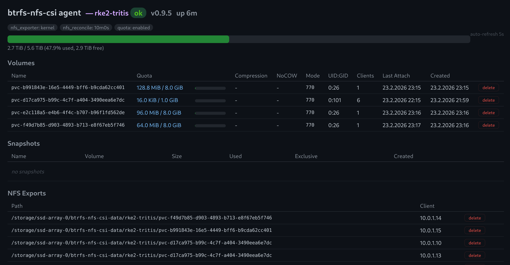

# btrfs-nfs-csi

[](https://github.com/erikmagkekse/btrfs-nfs-csi/actions/workflows/build.yml)
[](https://goreportcard.com/report/github.com/erikmagkekse/btrfs-nfs-csi)
[](LICENSE)

Kubernetes Enterprise storage vibes for your homelab. A single-binary CSI driver that turns any Linux box with a btrfs disk into a full-featured storage backend - instant snapshots, writable clones, per-volume quotas, live compression tuning, NoCOW for databases, and automatic NFS exports. Even with HA via DRBD. No iSCSI, no Ceph, no PhD required.

> **⚠️ Early stage** - this project is new and has only been tested with a single setup for a few weeks. Expect rough edges. Feedback and bug reports welcome.

### Dashboard



## Architecture

```
┌──────────────────────────────────────────────────────────┐
│                    Kubernetes Cluster                    │
│                                                          │
│  ┌─────────────────────┐     ┌────────────────────────┐  │
│  │   CSI Controller    │     │   CSI Node (DaemonSet) │  │
│  │   (Deployment)      │     │                        │  │
│  │                     │     │  NFS mount + bind mount│  │
│  │  Create/Delete ─────┼──┐  │  NodeGetVolumeStats    │  │
│  │  Snapshot/Clone     │  │  │                        │  │
│  │  Update             │  │  └────────────────────────┘  │
│  │  Publish/Unpublish  │  │                              │
│  └─────────────────────┘  │                              │
│                           │                              │
└───────────────────────────┼──────────────────────────────┘
                            │ HTTP/REST
                            ▼
              ┌──────────────────────────┐
              │     Agent (NFS Server)   │
              │                          │
              │  btrfs subvolume mgmt    │
              │  NFS export management   │
              │  multi-tenant isolation  │
              │  quota + usage tracking  │
              │  dashboard + metrics     │
              └──────────────────────────┘
```

Each StorageClass binds one agent + one tenant. Volume IDs use the StorageClass name, so agent URLs can change without breaking existing volumes.

## Why btrfs-nfs-csi?

Most Kubernetes storage solutions are built for the data center: Ceph, Longhorn, and OpenEBS bring clustering overhead, complex operations, and resource requirements that don't fit a homelab or small self-hosted setup. If all you have is a single Linux server (or two for HA) with a btrfs filesystem, you shouldn't need a distributed storage cluster just to get snapshots and quotas.

**btrfs-nfs-csi** bridges that gap:

- **Minimal resource footprint** - the agent and driver are single Go binaries with nearly no overhead. No JVM, no database. Runs comfortably on a Raspberry Pi or a 2-core VM.
- **Zero infrastructure overhead** - no etcd, no separate storage cluster, no distributed consensus. One binary on your NFS server, one driver in your cluster.
- **Leverages what btrfs already gives you** - subvolumes become PVs, btrfs snapshots become `VolumeSnapshots`, quotas become capacity tracking. No reinvention.
- **NFS "just works"** - every node can mount every volume without iSCSI initiators, multipath, or block device fencing. ReadWriteMany is the default, not a special case.
- **Homelab-friendly HA** - pair two servers with DRBD + Pacemaker for active/passive failover. No quorum games, no split-brain drama with three nodes you don't have.
- **Multi-tenant from day one** - a single agent can serve multiple clusters or teams, each isolated by tenant with its own subvolume tree.

If you run a homelab, a small on-prem cluster, or an edge deployment and want real storage features without the operational tax of a full SDS stack, this driver is for you.

## Features

- Instant snapshots and writable clones (btrfs CoW)
- Online volume expansion
- Per-volume quota enforcement and usage reporting
- Per-volume tuning via StorageClass parameters or PVC annotations:
  - Compression (`zstd`, `lzo`, `zlib` with levels)
  - NoCOW mode (`chattr +C`) for databases
  - UID/GID/mode
- Per-node NFS exports (auto-managed via `exportfs`)
- Multi-tenant: one agent serves multiple clusters
- Prometheus `/metrics` on all components
- Web dashboard (`/v1/dashboard`)
- TLS support
- HA via DRBD + Pacemaker (active/passive failover)

### Roadmap

- NFS-Ganesha userspace NFS server support (no more root requirement)
- CSI `LIST_VOLUMES` / `LIST_SNAPSHOTS`
- CSI `VOLUME_CONDITION` health reporting

## Quick Start

See [docs/installation.md](docs/installation.md) for agent setup, driver deployment, and PVC examples.

## Documentation

| Document | Description |
|---|---|
| [Installation](docs/installation.md) | Agent setup (btrfs, NFS, Quadlet, systemd, binary), driver setup, container build |
| [Configuration](docs/configuration.md) | Environment variables, StorageClass parameters, PVC annotations, secrets, TLS |
| [Architecture](docs/architecture.md) | Volume lifecycle, ID formats, directory structure, CSI capabilities, sidecars, RBAC, HA |
| [Operations](docs/operations.md) | Snapshots, clones, expansion, compression, NoCOW, quota, fsGroup, NFS exports |
| [Agent API](docs/agent-api.md) | All endpoints, request/response models, error codes, curl examples |
| [Metrics](docs/metrics.md) | All Prometheus metrics, PromQL examples |

## Building

```bash
go build -ldflags "-X main.version=$(cat VERSION) -X main.commit=$(git rev-parse --short HEAD)" -o btrfs-nfs-csi .
```

## Development

### Agent

```bash
sudo ./scripts/agent-dev-setup.sh up
AGENT_BASE_PATH=/tmp/btrfs-nfs-csi-dev AGENT_TENANTS=dev:dev ./btrfs-nfs-csi agent
sudo ./scripts/agent-dev-setup.sh down
```

## Contributing

Contributions are herzlich willkommen! Feel free to open issues or submit PRs.
